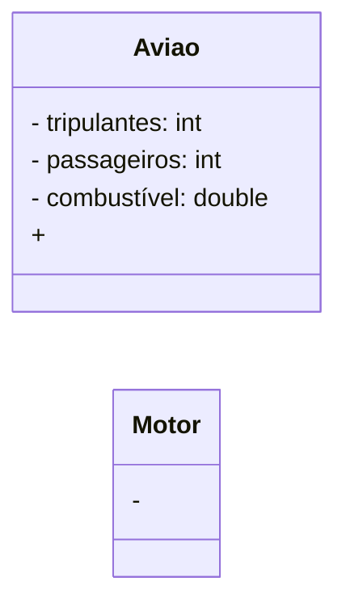

# Diagrama de Classes UML

```mermaid
classDiagram
    direction LR

    class Aviao{
        - tripulantes: int
        - passageiros: int
        - combustível: double
        + 
    }
    
    class Motor{
        - 
    }


``` 