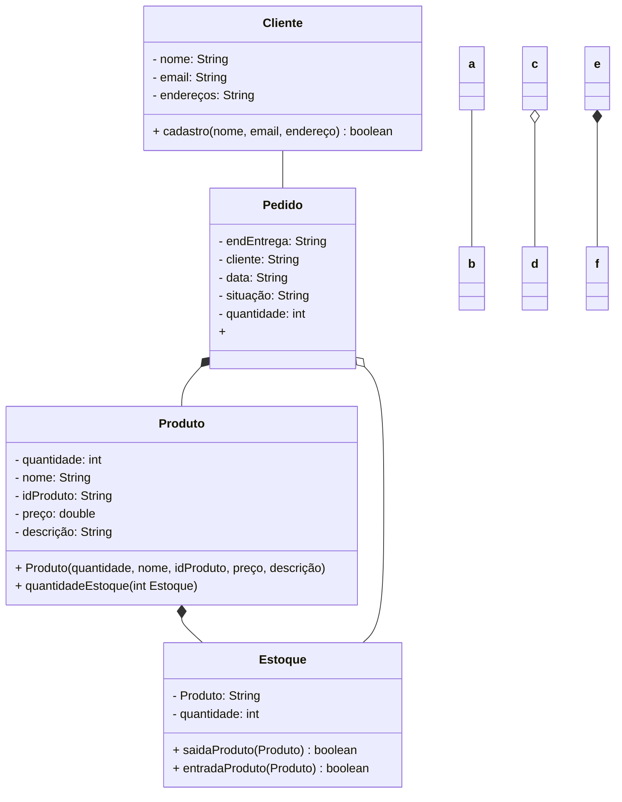

```mermaid
classDiagram
    
    class Cliente{
        - nome: String
        - email: String
        - endereços: String
        + cadastro (nome, email, endereço) boolean
        
    }
     
     Cliente -- Pedido
     
    class Estoque{
        - Produto: String
        - quantidade: int
        + saidaProduto (Produto) boolean
        + entradaProduto (Produto) boolean
    }
    
    Produto *-- Estoque
    Pedido *-- Produto
    
    class Produto{
        - quantidade: int
        - nome: String
        - idProduto: String
        - preço: double
        - descrição: String
        + Produto(quantidade, nome, idProduto, preço, descrição)
        + quantidadeEstoque (int Estoque)
    }
    
    Pedido o-- Estoque
    
    class Pedido{
        - endEntrega: String
        - cliente: String
        - data: String
        - situação: String
        - quantidade: int
        + 
    }

    a -- b
    c o-- d
    e *-- f


```